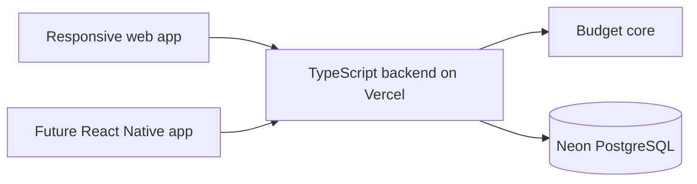
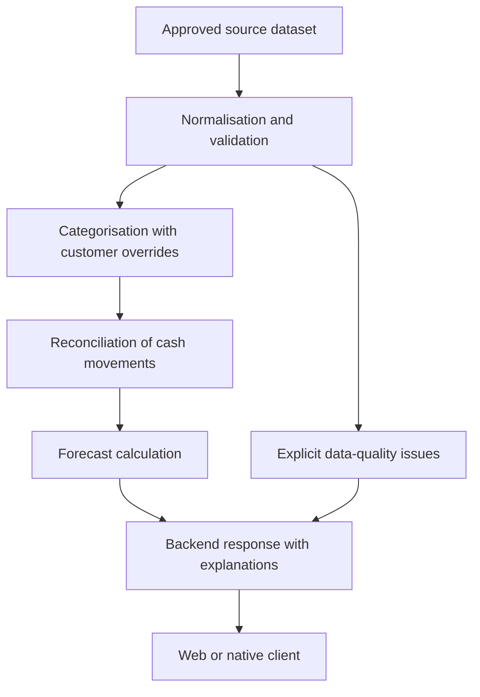

# Architecture

Status: agreed architectural direction for the prototype. The backend workspace now implements Express health routing and a read-only Neon connection check; other application directories remain scaffolds. The structures below describe where implementation will go; create subdirectories only when they have a responsibility and content.

## Goals and scope

Support a responsive desktop/mobile web application first, followed by a React Native application using the same backend. Keep UI presentation, application workflows, financial calculations and persistence independently understandable and testable.

Use [requirements](docs/requirements.md) and [user stories](docs/user-stories.md) as the behavioural baseline. The previous bachelor-project repository is not a source of current requirements.

## System boundaries

- `apps/web`: React, TypeScript and Vite; one responsive application for desktop and mobile browsers.
- `apps/backend`: TypeScript HTTP backend intended for Vercel. It validates requests, enforces access, coordinates workflows and performs authoritative calculations.
- `apps/mobile`: future React Native client with native screens and navigation.
- `packages/budget-core`: framework-independent calculation and data-processing logic.
- `packages/contracts`: shared API request/response types and runtime validation schemas.
- `database/migrations`: version-controlled PostgreSQL schema changes.
- Neon supplies PostgreSQL persistence. It is not the application's HTTP backend.



Both clients communicate with the backend API. Neither client connects directly to Neon. Only server-side configuration contains database credentials. Code sharing does not imply shared web and native UI components.

## Web application structure

```text
apps/web/src/
  app/
  foundation/
    components/
    styles/
  features/
    budget/
      components/
      containers/
      hooks/
      api/
      index.ts
    transactions/
    forecast/
  lib/
```

| Area | Responsibility | Must not own |
| --- | --- | --- |
| app | Application startup, routes, providers and composition of feature screens | Financial rules or database access |
| foundation/components | Reusable presentation primitives such as Button, Input, Card and Dialog | Budget knowledge, feature imports or business API calls |
| foundation/styles | Shared colours, typography, spacing and global styles | Feature-specific behaviour |
| features/*/components | Feature-specific presentation with explicit props and callbacks | Fetching and persistence mixed into display components |
| features/*/containers | Coordinate screen data, state, loading, errors and user actions | Financial algorithms or direct database access |
| features/*/hooks | Reusable feature state and orchestration where useful | An unnecessary wrapper for every component |
| features/*/api | Feature-specific backend requests and response handling | UI rendering or server credentials |
| lib | Technical utilities such as the shared HTTP client | Unrelated business logic collected in a global helper folder |

### Component rules

1. Foundation components are domain-agnostic. A Button does not know what a budget is. They receive props and report interactions through callbacks.
2. Local UI state is allowed in foundation components, for example whether a dropdown is open. Business state and network requests remain outside them.
3. Feature components follow single responsibility. BudgetSummary renders a summary; BudgetSetupContainer coordinates setup inputs, requests and feedback.
4. Keep feature-specific components inside their feature even when several screens use them. Promote code to foundation only when it is genuinely general-purpose.
5. Keep state close to its owner. Use app-level providers only for genuinely cross-cutting concerns, rather than putting all feature state in a global store.
6. A feature's index.ts exposes a small public interface. Other features must not import its internal files. Avoid circular dependencies; compose workflows in app when appropriate.
7. Add containers, hooks and api files only where they simplify an actual responsibility. Do not split a small component solely to match the directory tree.
8. Put tests beside the component or module they cover. Include keyboard, labels, loading, empty and error states where relevant.

### Dependency direction

App composes features. Features may depend on foundation, lib and contracts. Foundation never imports features, backend code or database code. Lib does not import features. Contracts must remain usable by both web and native clients and by the backend.

The web may format money and validate form input, but the backend validates requests again and calculates authoritative financial results. Do not duplicate forecasting algorithms in UI components.

## Backend structure

```text
apps/backend/src/
  features/
    budgets/
    transactions/
    forecasts/
  infrastructure/
  shared/
```

Within each backend feature, introduce these responsibilities as needed:

- Routes: HTTP request parsing, boundary validation, authentication context and response/status mapping.
- Services: application workflows, access checks, coordination of repositories and budget-core, and transaction boundaries.
- Repositories: queries and persistence mapping. They do not render UI or calculate forecasts.
- Infrastructure: database connection configuration and external integration adapters.
- Shared: genuinely shared error handling, request helpers and cross-cutting server utilities.

Routes call services; services call repositories and budget-core. Repository implementations use the infrastructure database connection. Budget-core must not depend on routes, repositories, React, Vercel or Neon. Shared backend code must not become a dependency cycle between features.

Derive the customer identity from the authenticated server context, never trust a customer ID supplied by a client as proof of ownership. All account and budget operations must enforce the corresponding access rules. Authentication technology is still an open implementation decision; it must be resolved before a shared deployment exposes customer-scoped data.

## Shared packages

### budget-core

Keep normalisation, categorisation, reconciliation and forecasting deterministic where possible. Pass input data and the calculation date explicitly. Use integer oere or exact decimal arithmetic. Return explicit data-quality issues rather than silently interpreting missing values as zero.

Keep budget plans distinct from forecast estimates. Quarterly and annual bills have both monthly planning equivalents and dated cash movements; do not count both as cash outflows. Internal transfers within a budget must not inflate income or spending. Review the existing local budget-core experiment against current requirements before migration.

### contracts

Share request/response types, runtime validation schemas and documented error formats. Keep database drivers, persistence entities, UI frameworks and secrets out of this package. TypeScript types alone do not validate untrusted runtime input. Convert persistence records and calculation results to explicit API responses at the backend boundary.

## Data flow



The diagram shows logical processing stages, not separate deployed services. Imported source records and customer overrides remain distinguishable so re-imports do not silently erase corrections. Mark invalid or uncertain records for review; do not silently discard them or invent replacement values. Reconcile booked transactions, pending movements and planned payments before combining them in a forecast.

Budget creation must validate account ownership and enforce the one-budget-per-account rule atomically, including concurrent requests. The database schema and transaction strategy must support this rule; disabling a checkbox in the frontend is insufficient.

Use dated forecasts with their input period and material assumptions. A successful budget save and an unavailable forecast are distinct outcomes; the response and UI should represent them separately.

## Persistence and deployment

Store schema changes under database/migrations and select a migration tool before creating executable migrations. Keep migration history and synthetic fixtures separate. Do not commit database credentials, raw banking datasets or database dumps.

The agreed hosting direction is Vercel for the backend and Neon for PostgreSQL. Neon is provisioned with production and development branches in Frankfurt. The backend uses npm workspaces, Express and Drizzle with the Neon HTTP driver. The local connection is stored in an ignored apps/backend/.env file. Deployment and domain migrations are not implemented yet. Before deployment, document database connection management, regions, secrets, access control and permitted data use. Confirm approval before uploading the supplied bank dataset to cloud services.

No production banking connection or payment execution is in the initial scope.

## Verification

- Unit tests: pure calculations, normalisation, classification overrides and reconciliation edge cases.
- Component tests: observable UI behaviour, including accessibility and uncertainty states.
- Backend integration tests: request validation, account ownership, persistence, concurrency and errors using an isolated test database.
- End-to-end tests: create and reopen a budget, review corrections and interpret forecast availability.
- Usability and forecast evaluation: follow the delivery plan; passing automated tests is not evidence of forecast accuracy or user understanding.

Use stable FR, NFR and US identifiers to connect tests and implementation with the requirements. Do not claim build/test commands exist until their workspace configuration is committed.

## Next implementation decisions

1. Authentication and domain API error conventions. Express is selected for HTTP; the initial 404 format is { error: { code, message } }.
2. Additional workspace and lint tooling as web/shared packages are initialised; backend commands are documented in apps/backend/README.md.
3. PostgreSQL schema, migration tool and test-database setup.
4. Forecast balance basis, minimum historical coverage and uncertain payment handling.
5. Deployment environments and approved use of the supplied dataset.

Keep AGENTS.md commands aligned with the implemented workspace workflow. Update this document when a decision changes rather than letting implementation and documentation diverge.
